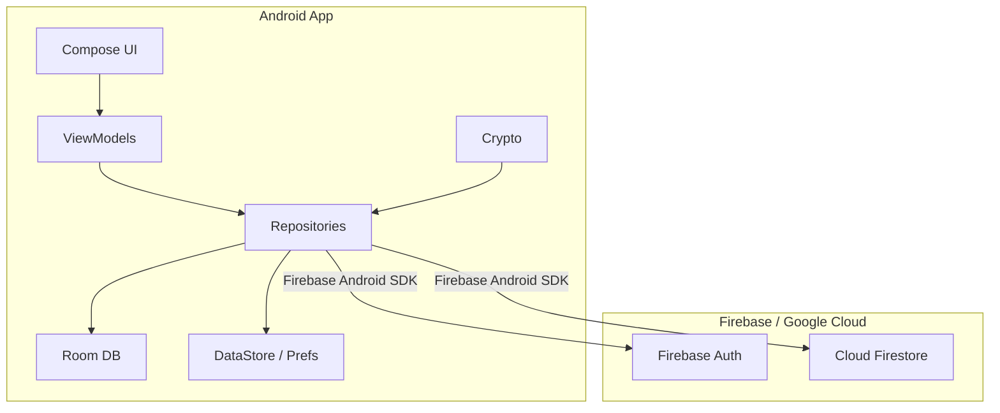
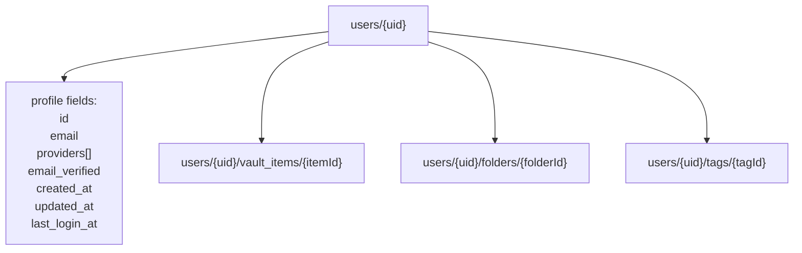
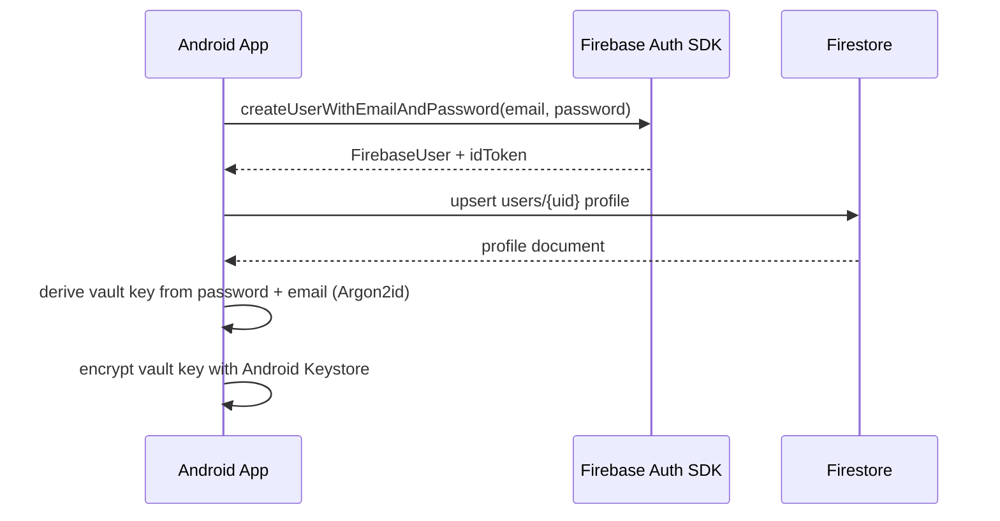
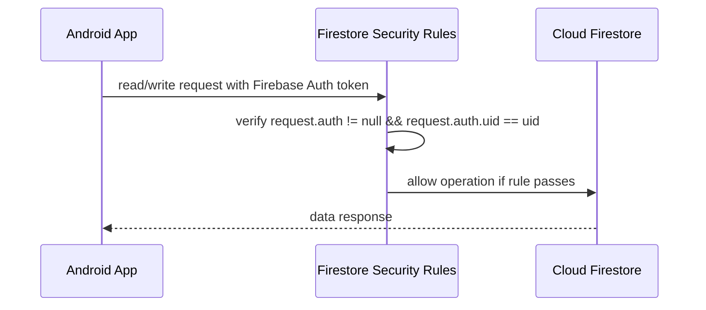
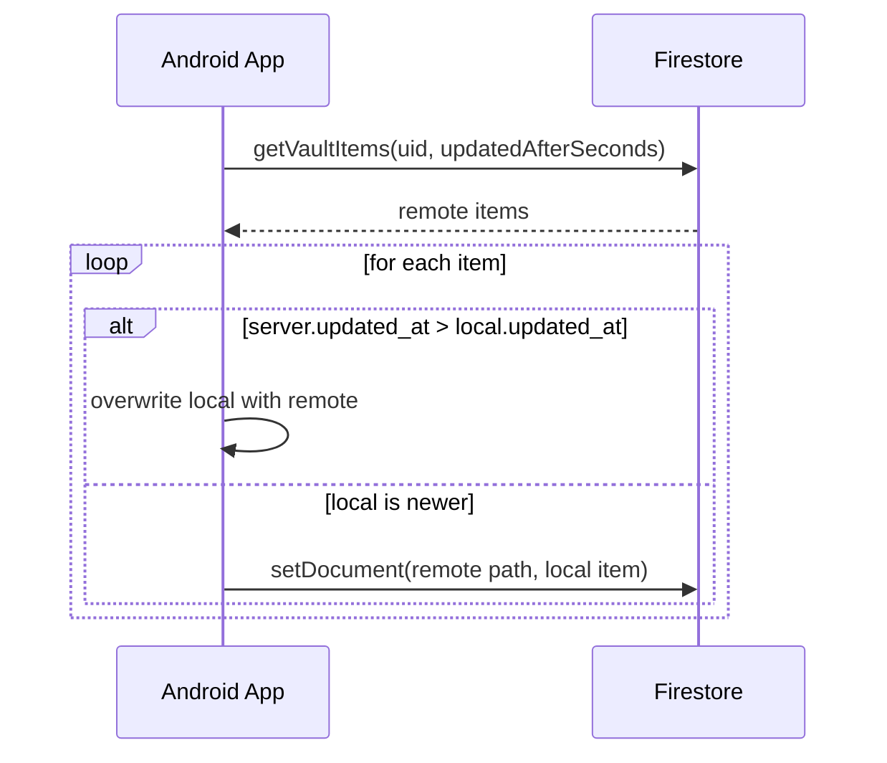
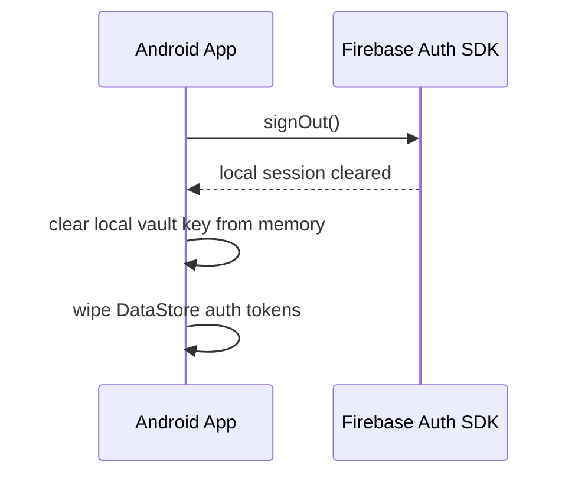
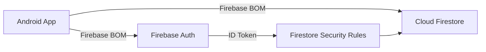

# Diagrams

> Updated for the Firebase-direct architecture on 2026-04-28.
> There is **no intermediate backend server**. The Android app communicates directly with Firebase.

---

## 1. Architecture Overview

---

## 2. Firestore Data Model

---

## 3. Email/Password Auth Flow

---

## 4. Firestore Security Rules

---

## 5. Sync Conflict Handling

---

## 6. Logout / Revocation Flow

---

## 7. Firebase Project Setup

