# Diagrams

> **Agent: update the relevant diagram whenever architecture, data, flows, or components change.**

---

## 1. Architecture Overview

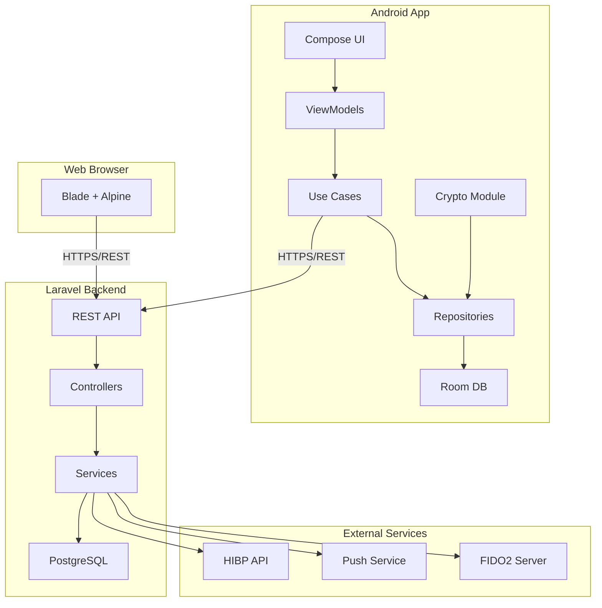

---

## 2. ER Diagram

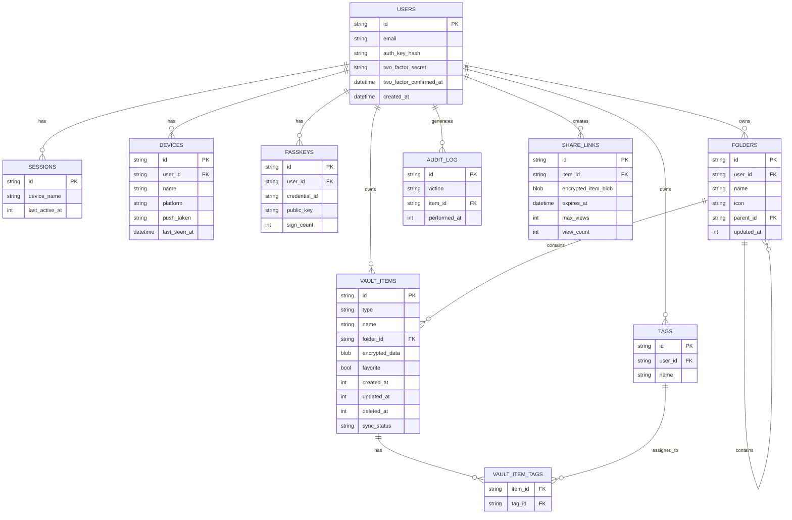

---

## 3. App Flow Flowchart

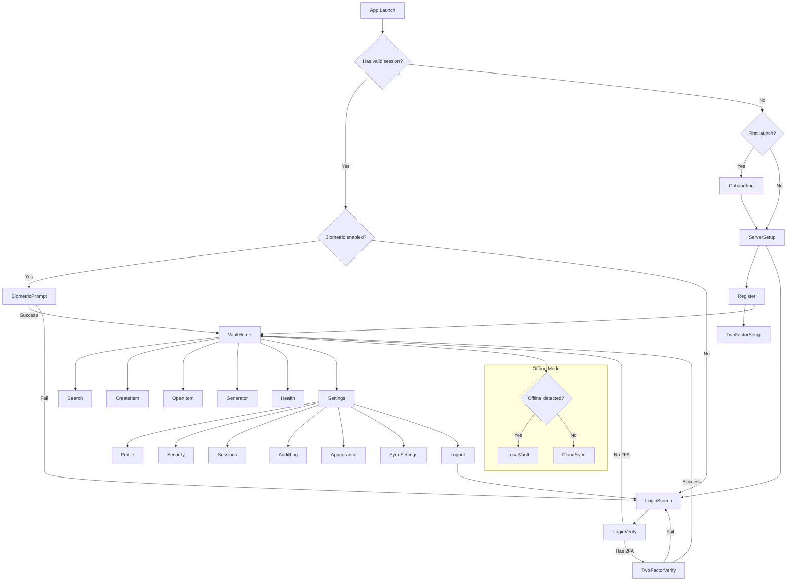

---

## 4. Component Diagram

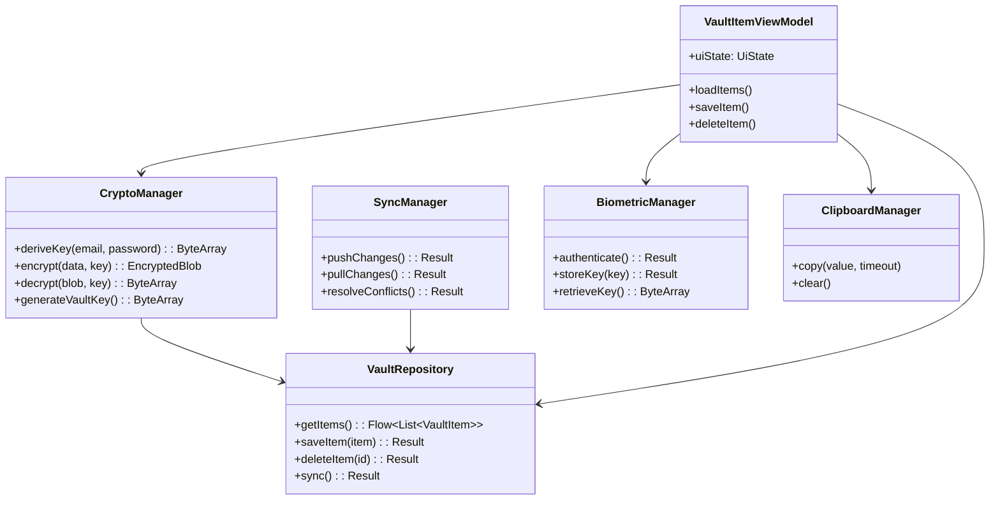

---

## 5. Class Diagram

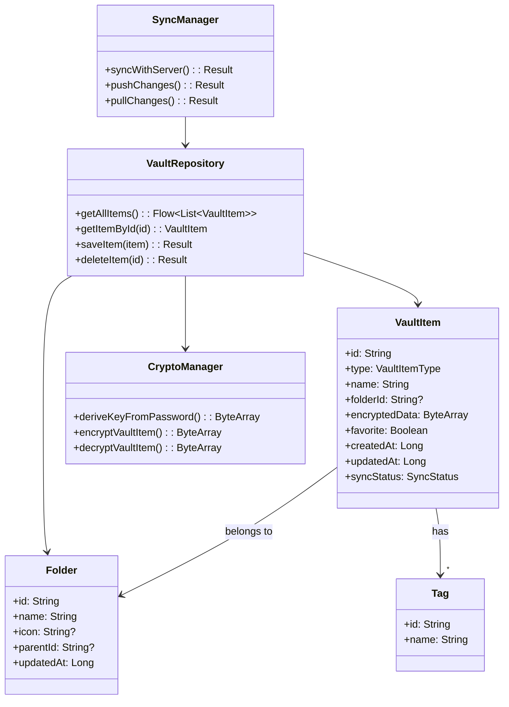

---

## 6. Object Diagram

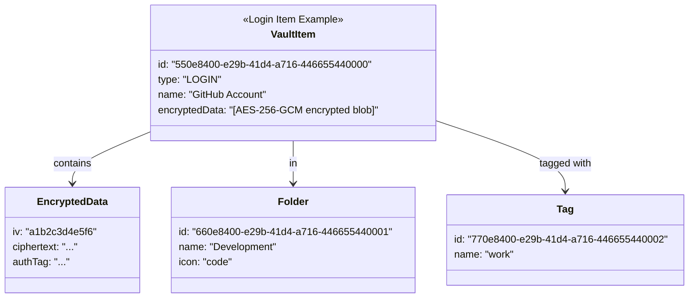

---

## 7. Sequence - Login Flow

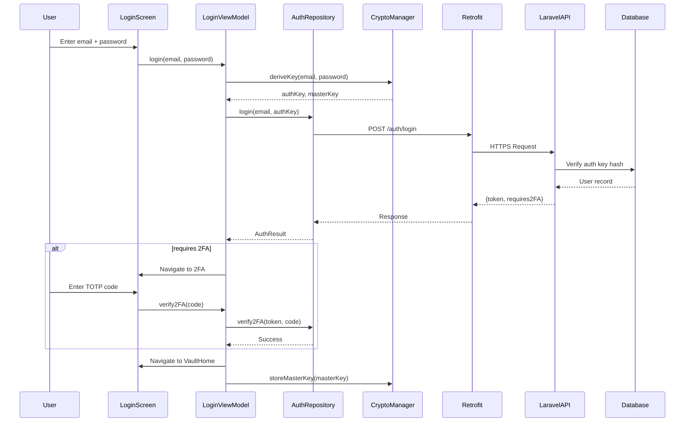

---

## 8. Sequence - Vault Sync

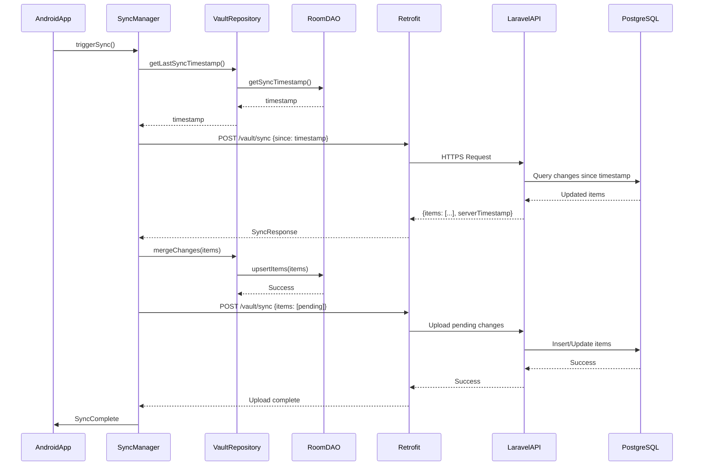

---

## 9. Use Case Diagram

```mermaid
flowchart TB
    subgraph Actors
        User["Unauthenticated User"]
        Owner["Vault Owner"]
        Contact["Emergency Contact"]
        Admin["Server Admin"]
    end
    
    subgraph UseCases
        Register["Register Account"]
        Login["Login"]
        Biometric["Biometric Unlock"]
        Passkey["Passkey Login"]
        ViewVault["View Vault"]
        CreateItem["Create Vault Item"]
        EditItem["Edit Vault Item"]
        DeleteItem["Delete Vault Item"]
        GeneratePassword["Generate Password"]
        ImportData["Import Data"]
        ExportData["Export Data"]
        CheckBreach["Check Breaches"]
        ShareItem["Share Item"]
        ViewAudit["View Audit Log"]
        ManageSessions["Manage Sessions"]
        RequestAccess["Request Emergency Access"]
        GrantAccess["Grant Emergency Access"]
    end
    
    User --> Register
    User --> Login
    User --> Passkey
    
    Owner --> Biometric
    Owner --> ViewVault
    Owner --> CreateItem
    Owner --> EditItem
    Owner --> DeleteItem
    Owner --> GeneratePassword
    Owner --> ImportData
    Owner --> ExportData
    Owner --> CheckBreach
    Owner --> ShareItem
    Owner --> ViewAudit
    Owner --> ManageSessions
    
    Contact --> RequestAccess
    Owner --> GrantAccess
```

---

## 10. Activity Diagram

```mermaid
activityDiagram
    start
    :Launch App;
    
    if First Launch? then
        -->[Yes] :Show Onboarding
        :Navigate to Server Setup
    else
        -->[No] :Check Session
    end
    
    if Valid Session? then
        -->[Yes] :Check Biometric
        if Biometric Available and Enabled? then
            -->[Yes] :Prompt Biometric
            if Success? then
                -->[Yes] :Open Vault Home
            else
                -->[No] :Show Login
            end
        else
            -->[No] :Show Login
        end
    else
        -->[No] :Show Login
    end
    
    :Login or Register;
    
    if Requires 2FA? then
        -->[Yes] :Verify 2FA
    else
        -->[No] :Open Vault
    end
    
    :Vault Home;
    
    if Offline Mode? then
        -->[Yes] :Use Local Only
    else
        -->[No] :Check Sync
    end
    
    if Sync Available? then
        -->[Yes] :Sync with Server
    else
        -->[No] :Continue Offline
    end
    
    stop
```

---

## 11. State Machine - Network Request

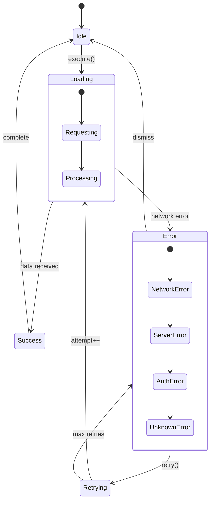

---

## 12. Deployment Diagram

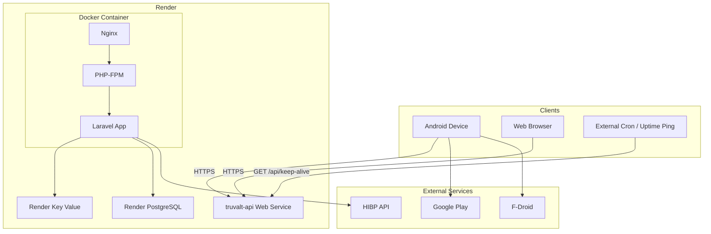

---

## 13. Data Flow - Vault Item Save

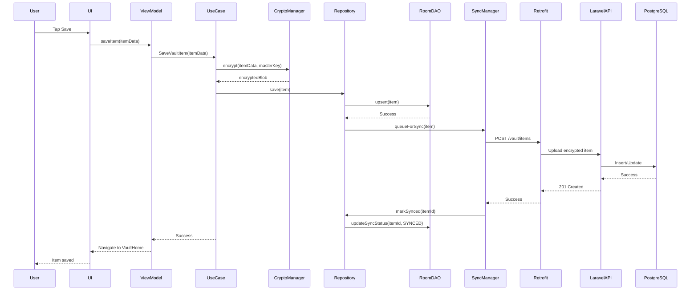
