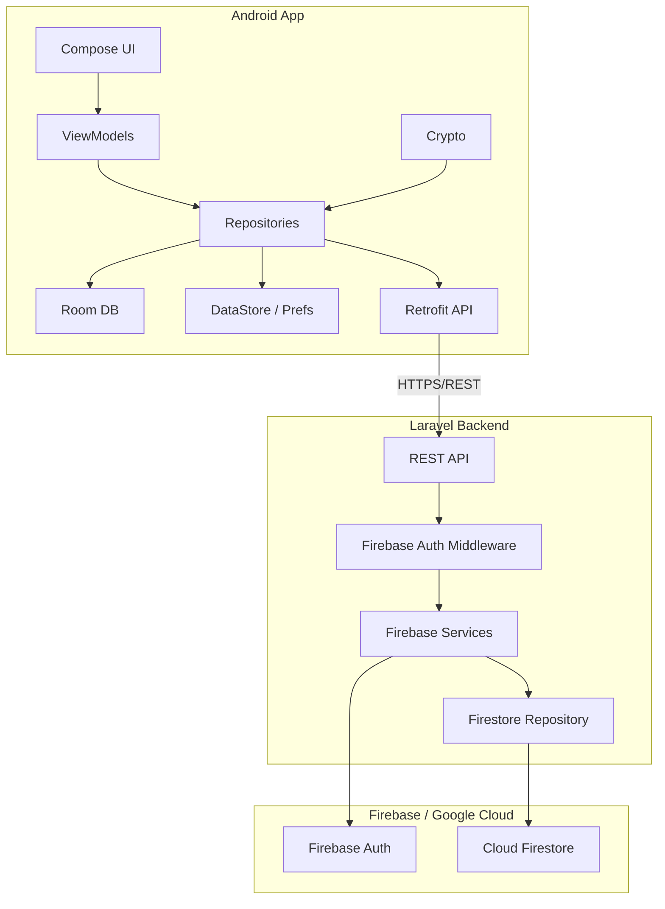
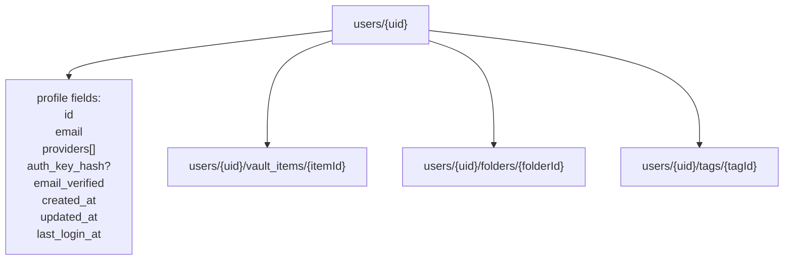
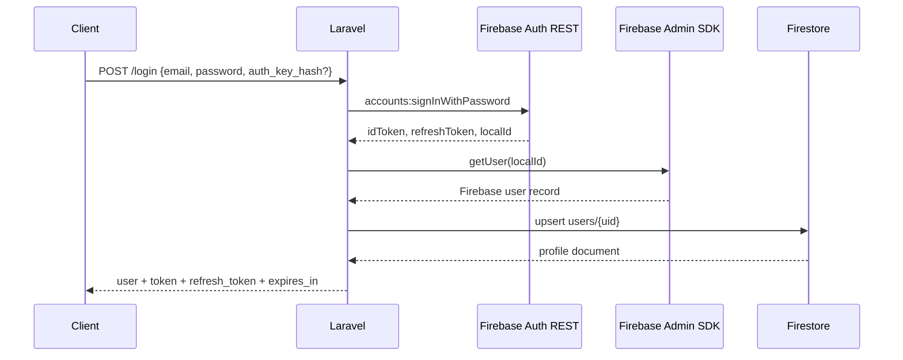
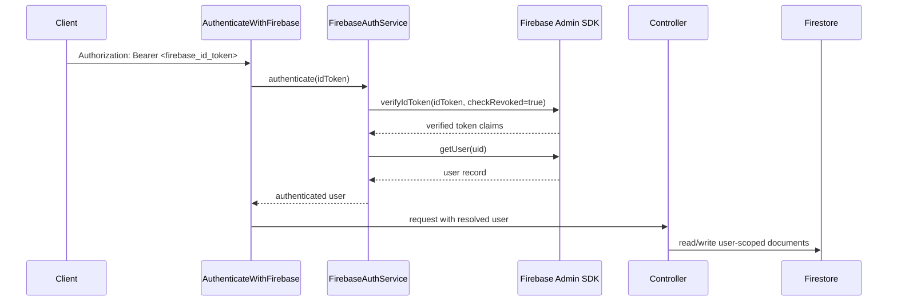
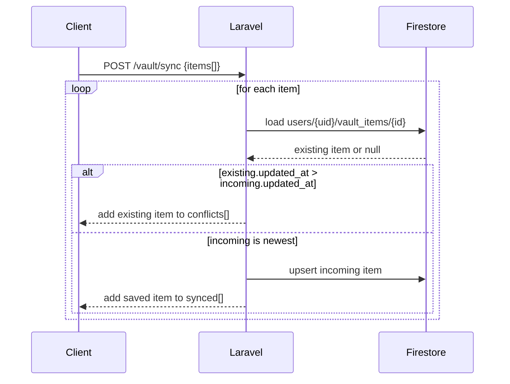
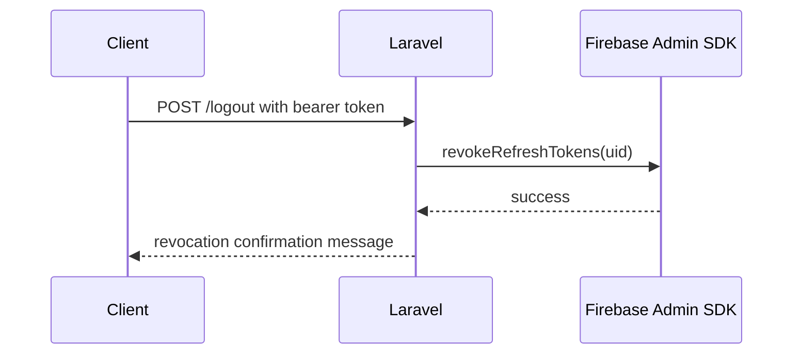
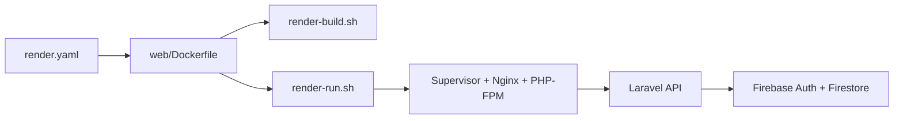

# Diagrams

> Updated for the Firebase Auth + Firestore backend pivot on 2026-03-23.

---

## 1. Architecture Overview

---

## 2. Firestore Data Model

---

## 3. Email/Password Auth Flow

---

## 4. Protected Route Verification

---

## 5. Sync Conflict Handling

---

## 6. Logout / Revocation Flow

---

## 7. Render Runtime Flow

