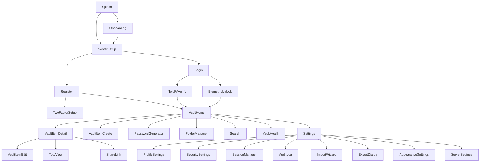

# UI/UX Documentation

---

## 1. Navigation Map

---

## 2. Screen Documentation

### 2.1 Splash Screen

| Attribute | Value |
|---|---|
| **Route/ID** | `splash` |
| **Purpose** | App launch, check existing session, biometric availability |
| **UI Elements** | App logo, tagline, loading indicator |
| **States** | Loading, BiometricPrompt, NavigateToHome, NavigateToOnboarding |
| **Navigation** | Exit → Onboarding or ServerSetup or VaultHome |

---

### 2.2 Onboarding

| Attribute | Value |
|---|---|
| **Route/ID** | `onboarding` |
| **Purpose** | First-time user introduction (3 slides) |
| **UI Elements** | PageView with illustrations, Next/Skip buttons, page indicators |
| **States** | Page1, Page2, Page3, Complete |
| **Navigation** | Exit → ServerSetup |

---

### 2.3 Server URL Setup

| Attribute | Value |
|---|---|
| **Route/ID** | `server_setup` |
| **Purpose** | Configure self-hosted backend URL |
| **UI Elements** | TextField (URL), Save button, Test Connection button, "Use local only" checkbox |
| **Validation** | URL must be valid format, connection test must succeed |
| **Navigation** | Exit → Login or Register |

---

### 2.4 Register

| Attribute | Value |
|---|---|
| **Route/ID** | `register` |
| **Purpose** | Create new account with email + master password |
| **UI Elements** | Email field, Master password field (with visibility toggle), Password hint field, Register button |
| **Validation** | Email format, password strength meter (zxcvbn), hint optional |
| **Navigation** | Exit → TwoFactorSetup or VaultHome |

---

### 2.5 Login

| Attribute | Value |
|---|---|
| **Route/ID** | `login` |
| **Purpose** | Authenticate with email + master password |
| **UI Elements** | Email field, Master password field, Login button, Forgot password link |
| **Validation** | Email format, password not empty |
| **Navigation** | Exit → TwoFAVerify or BiometricUnlock or VaultHome |

---

### 2.6 Two-Factor Verify

| Attribute | Value |
|---|---|
| **Route/ID** | `two_factor_verify` |
| **Purpose** | Enter TOTP code from authenticator app |
| **UI Elements** | 6-digit code input (auto-focus next), Verify button, Use passkey option |
| **Validation** | 6 digits required |
| **Navigation** | Success → VaultHome, Fail → Show error |

---

### 2.7 Biometric Unlock

| Attribute | Value |
|---|---|
| **Route/ID** | `biometric_unlock` |
| **Purpose** | Unlock vault using fingerprint/face |
| **UI Elements** | BiometricPrompt, Use password fallback button |
| **States** | AwaitingBiometric, Success, Failed, FallbackToPassword |
| **Navigation** | Success → VaultHome, Fallback → Login |

---

### 2.8 Vault Home

| Attribute | Value |
|---|---|
| **Route/ID** | `vault_home` |
| **Purpose** | Display vault items list with search and filters |
| **UI Elements** | SearchBar, FilterChips (All, Favorites, Logins, Notes, etc.), VaultItemCard list, FAB (add item), BottomNav |
| **States** | Loading, Empty, Populated, SearchResults, Filtered |
| **Navigation** | Item tap → VaultItemDetail, FAB → VaultItemCreate, Search → SearchResults |

---

### 2.9 Vault Item Detail

| Attribute | Value |
|---|---|
| **Route/ID** | `vault_item_detail` |
| **Purpose** | Display and interact with vault item fields |
| **UI Elements** | Item icon, name, type chip, field rows (label, value, copy button), Edit button, Delete button, Share button |
| **States** | Loading, Loaded, TOTPDisplay (if applicable) |
| **Navigation** | Edit → VaultItemEdit, Delete → Confirm dialog |

---

### 2.10 Vault Item Create/Edit

| Attribute | Value |
|---|---|
| **Route/ID** | `vault_item_edit` |
| **Purpose** | Create or modify vault item |
| **UI Elements** | Type selector, Name field, Dynamic fields based on type, Save button, Cancel button |
| **Validation** | Name required, type-specific validation |
| **Navigation** | Save → VaultHome, Cancel → Back |

---

### 2.11 Password Generator

| Attribute | Value |
|---|---|
| **Route/ID** | `password_generator` |
| **Purpose** | Generate secure passwords or passphrases |
| **UI Elements** | Generated value display, Length slider, Character options (uppercase, lowercase, digits, symbols), Exclude ambiguous checkbox, Generate button, Copy button, Use button |
| **States** | Idle, Generated |
| **Navigation** | Use → Insert into current field, Copy → Clipboard |

---

### 2.12 Folder Manager

| Attribute | Value |
|---|---|
| **Route/ID** | `folder_manager` |
| **Purpose** | Create, edit, delete, reorder folders |
| **UI Elements** | Folder list (nested), Add folder FAB, Drag handles, Edit/Delete actions |
| **Navigation** | Select folder → Filter vault by folder |

---

### 2.13 Search Results

| Attribute | Value |
|---|---|
| **Route/ID** | `search` |
| **Purpose** | Display search results |
| **UI Elements** | SearchBar (pre-filled), Result list |
| **Navigation** | Item tap → VaultItemDetail |

---

### 2.14 Vault Health Dashboard

| Attribute | Value |
|---|---|
| **Route/ID** | `vault_health` |
| **Purpose** | Show security health metrics |
| **UI Elements** | HealthScoreCard, Weak passwords count, Reused passwords count, Old passwords count, Breached passwords list |
| **Navigation** | Item tap → VaultItemDetail |

---

### 2.15 Import Wizard

| Attribute | Value |
|---|---|
| **Route/ID** | `import_wizard` |
| **Purpose** | Import data from other password managers |
| **UI Elements** | Format selector (chips), File picker, Preview list, Import button, Progress indicator |
| **States** | FormatSelect, FilePick, Preview, Importing, Complete |
| **Navigation** | Complete → VaultHome |

---

### 2.16 Export Dialog

| Attribute | Value |
|---|---|
| **Route/ID** | `export_dialog` |
| **Purpose** | Export vault to file |
| **UI Elements** | Format selector (.truvalt, JSON, CSV), Password field (for .truvalt), Export button |
| **Validation** | Export password required for .truvalt format |
| **Navigation** | Complete → Share/Save file |

---

### 2.17 Share Link Creator

| Attribute | Value |
|---|---|
| **Route/ID** | `share_link_create` |
| **Purpose** | Create encrypted share link for item |
| **UI Elements** | Expiration selector (1h, 24h, 7d), Max views input, Create button, Share button |
| **Navigation** | Create → Copy link |

---

### 2.18 Settings Home

| Attribute | Value |
|---|---|
| **Route/ID** | `settings` |
| **Purpose** | Access all settings |
| **UI Elements** | Settings list (profile, security, sessions, appearance, import/export, about) |
| **Navigation** | Item → respective settings screen |

---

### 2.19 Profile Settings

| Attribute | Value |
|---|---|
| **Route/ID** | `settings_profile` |
| **Purpose** | Manage user profile |
| **UI Elements** | Email display, Change email, Change password, Delete account |

---

### 2.20 Security Settings

| Attribute | Value |
|---|---|
| **Route/ID** | `settings_security` |
| **Purpose** | Manage 2FA, passkeys, session |
| **UI Elements** | 2FA toggle/setup, Passkeys list, Biometric toggle |

---

### 2.21 Session Manager

| Attribute | Value |
|---|---|
| **Route/ID** | `settings_sessions` |
| **Purpose** | View and revoke active sessions |
| **UI Elements** | Session list with device info, Revoke button per session |

---

### 2.22 Audit Log

| Attribute | Value |
|---|---|
| **Route/ID** | `settings_audit_log` |
| **Purpose** | View security event history |
| **UI Elements** | Event list (login, access, change, export, share), Date filter |

---

### 2.23 Appearance Settings

| Attribute | Value |
|---|---|
| **Route/ID** | `settings_appearance` |
| **Purpose** | Configure theme |
| **UI Elements** | Theme selector (System, Light, Dark, AMOLED) |

---

### 2.24 Server/Sync Settings

| Attribute | Value |
|---|---|
| **Route/ID** | `settings_server` |
| **Purpose** | Configure sync settings |
| **UI Elements** | Server URL, Sync toggle, Last sync time, Sync now button, Clear local data |

---

### 2.25 Trash

| Attribute | Value |
|---|---|
| **Route/ID** | `trash` |
| **Purpose** | View and restore deleted items |
| **UI Elements** | Deleted items list, Restore button, Permanent delete button |

---

## 3. Common Components

| Component | Description | Used In |
|---|---|---|
| `VaultItemCard` | Item type icon, name, username/subtitle, favorite indicator, copy button | VaultHome, Search |
| `TotpCountdownRing` | Circular progress ring counting down TOTP period | VaultItemDetail, TotpView |
| `PasswordStrengthBar` | 4-level color bar with zxcvbn score label | Generator, ItemEdit |
| `EncryptedFieldRow` | Hidden field with eye toggle, copy button, reveal timeout | ItemDetail |
| `TypeChip` | Colored chip showing vault item type | ItemDetail, ItemList |
| `HealthScoreCard` | Vault health summary with severity counters | VaultHealth |
| `SecureClipboardSnackbar` | Shows "Copied — clears in Xs" with cancel action | Global |
| `BiometricPromptLauncher` | Triggers Android BiometricPrompt | BiometricUnlock |
| `LoadingShimmer` | Shimmer cards for vault list loading state | VaultHome |
| `EmptyVaultState` | Illustration + CTA for empty vault or search | VaultHome, Search |
| `ErrorState` | Icon + message + retry button | All async screens |
| `SyncStatusIndicator` | Animated sync icon in TopAppBar | VaultHome |

---

## 4. Gestures and Interactions

| Gesture | Element | Result |
|---|---|---|
| Long press | VaultItemCard | Multi-select mode |
| Swipe left | VaultItemCard | Quick-delete (confirm dialog) |
| Swipe right | VaultItemCard | Quick-copy password |
| Pull down | VaultHome | Manual sync trigger |
| Long press | EncryptedFieldRow | Copy to clipboard |
| Tap | TotpCountdownRing | Copy TOTP code |
| Double tap | VaultItemCard | Open detail |

---

## 5. Web Vault Screens

The web vault mirrors the Android screens with appropriate adaptations:

- **Login/Register:** Web forms with browser WebAuthn support
- **Vault Home:** Responsive grid/list with sidebar navigation
- **Vault Item Detail:** Web modal or page with clipboard API
- **Settings:** Full-page web forms
- **Generator:** Accessible as floating button

All web screens use Laravel Blade templates with Tailwind CSS styling and Alpine.js for interactivity.
