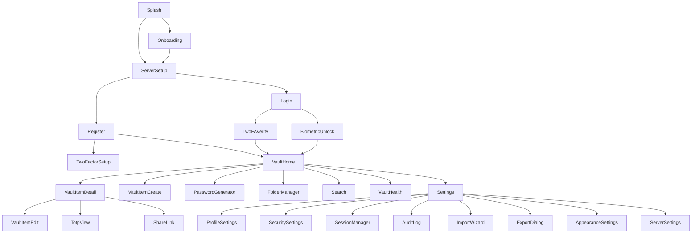

# 🔐 truvalt — Agent Prompt: Project Structure & Documentation

> Send everything below the horizontal rule to your agent.

---

You are building **truvalt**, a cross-platform password manager with an **Android app** (Kotlin + Jetpack Compose) and a **web app** (Laravel 12 + Blade). Before writing any code, create a complete `/docs` folder in the project root with all the files listed below. All files must be in Markdown format. Use Mermaid syntax for all diagrams.

---

## App Details

- **App Name:** `truvalt`
- **Package Name:** `com.ivarna.truvalt`
- **Web App URL Slug:** `truvalt`
- **Description:** truvalt is a cross-platform, end-to-end encrypted password manager that runs as a native Android app and a full Laravel 12 web application. Users can securely store passwords, passkeys, passphrases, secure notes, TOTP 2FA codes, and security/recovery codes — with optional cloud sync or fully local-only operation.
- **Target Users:** Privacy-conscious individuals, developers, and teams who need secure, self-hostable credential management across Android and the web.
- **Architecture (Android):** Clean Architecture + MVVM
- **Architecture (Web):** Laravel MVC with Service/Repository pattern
- **UI Framework (Android):** Jetpack Compose with Material Design 3 (Material You)
- **UI Framework (Web):** Laravel 12 Blade + Tailwind CSS + Alpine.js
- **Min SDK:** API 26 (Android 8.0)
- **Target SDK:** API 36
- **Key Features:** Password vault, password generator, passkey storage, passphrase storage, TOTP 2FA authenticator codes storage, security & recovery code storage, secure notes, biometric unlock, email+password auth, TOTP-based 2FA login, passkey login (WebAuthn), end-to-end encryption (AES-256-GCM + Argon2id key derivation), cloud sync (self-hosted), local-only offline mode, import/export (CSV, JSON, encrypted `.truvalt` format), password strength analyzer, breach check (Have I Been Pwned API), folder/tag organization, secure clipboard with auto-clear, password sharing (encrypted link), browser-accessible web vault, dark/light/AMOLED themes, audit log, emergency access, session management
- **Backend Required:** Yes
- **Backend Type:** Laravel 12 REST API (JSON) + web vault UI (Blade)
- **Database:** PostgreSQL (server) + Room (Android local vault)
- **Auth Method:** Email + Password (Argon2id hashed) + TOTP 2FA + Passkey (WebAuthn / FIDO2)
- **Distribution:** Google Play Store + F-Droid
- **Locales:** en-US (initial), with i18n scaffolding for hi-IN, de-DE

---

## PLATFORM SCOPE CLARIFICATION

This project has **three distinct sub-projects** in one monorepo:

```
truvalt/
├── android/          ← Kotlin + Compose Android app (this prompt's primary focus)
├── web/              ← Laravel 12 + Blade web vault + REST API backend
├── docs/             ← Shared documentation (this prompt creates this)
└── fastlane/         ← Release automation (this prompt creates this)
```

All documentation in `/docs` covers BOTH platforms. Diagrams must reflect both the Android client and the Laravel web/backend.

---

## Files to Create

---

### `/docs/README.md`

Master index table listing every file in `/docs` with its name, description, and a "last updated" column. At the top, add a bold warning block:

> **AGENT STRICT RULE: Whenever any feature is added, modified, or removed; any screen changes; the database schema changes; the API changes; any task status changes — you MUST update every affected document immediately. Do not leave any document stale. After every change, re-read this README and confirm all docs reflect the current state.**

Also include a "change type → documents to update" mapping table. Example rows:

| Change Type | Documents to Update |
|---|---|
| New vault item type added | FEATURES.md, SRS.md, SDD.md, UI_UX_DOCUMENTATION.md, DIAGRAMS.md, TODO.md |
| New API endpoint | SDD.md, DIAGRAMS.md, backend/API_DOCS.md |
| New screen (Android or Web) | UI_UX_DOCUMENTATION.md, UI_DESIGN_SYSTEM.md, DIAGRAMS.md |
| Database schema change | SDD.md, DIAGRAMS.md (ER), backend/API_DOCS.md |
| Feature completed | FEATURES.md (status), TODO.md → FINISHED.md |
| Security model change | SRS.md, SDD.md, DIAGRAMS.md, backend/README.md |

---

### `/docs/PROBLEM_STATEMENT.md`

Include these sections:

**Background and context:** The average person has 100+ online accounts. Popular cloud password managers (LastPass, 1Password) have suffered high-profile breaches and require monthly subscriptions. Open-source alternatives lack polished cross-platform native clients or require complex self-hosting setup. truvalt fills this gap.

**The specific problem being solved:** Users need a secure, self-hostable, or fully offline password manager that works natively on Android and via any web browser — with zero-knowledge end-to-end encryption, no mandatory subscription, and a first-class UI on both platforms.

**Who is affected (table: user type, description, pain point):**

| User Type | Description | Pain Point |
|---|---|---|
| Privacy-conscious individual | Doesn't want credentials stored on third-party US servers | No control over where data lives |
| Developer / sysadmin | Manages many API keys, SSH passphrases, server passwords | Needs developer-friendly import/export and CLI potential |
| Small team | Shared vault for service credentials | Expensive per-seat pricing on commercial tools |
| Self-hoster | Runs own infrastructure | Bitwarden is complex to self-host; other options lack polish |
| Android power user | Primarily lives on Android | Poor native Android UX in many open-source options |

**Goals (checklist), Out of scope, Success metrics, Constraints** — all filled in based on the app description above.

---

### `/docs/SRS.md` — Software Requirements Specification

Include all standard SRS sections. Use requirement IDs in format `FR-[MODULE]-[NUMBER]`. Modules:

- `AUTH` — Authentication & Session
- `VAULT` — Vault item CRUD (passwords, passkeys, passphrases, secure notes, 2FA seeds, security codes)
- `GEN` — Password & Passphrase Generator
- `SYNC` — Cloud Sync & Conflict Resolution
- `CRYPTO` — Encryption & Key Management
- `IMPORT` — Import / Export
- `BREACH` — Breach & Strength Analysis
- `SHARE` — Secure Sharing
- `AUDIT` — Audit Log & Session Management
- `NOTIF` — Notifications & Clipboard
- `SETTINGS` — User Preferences & Themes
- `ADMIN` — Server Administration (web only)

**Key functional requirements to include (add full tables with Priority column):**

- FR-AUTH-01: User registers with email + master password. Master password is NEVER sent to server; only a derived authentication key is used.
- FR-AUTH-02: Login with email + auth key.
- FR-AUTH-03: TOTP 2FA via authenticator app (RFC 6238).
- FR-AUTH-04: Passkey login (WebAuthn FIDO2) on web and Android (Credential Manager API).
- FR-AUTH-05: Biometric unlock (Android — unlocks local vault key from Android Keystore).
- FR-AUTH-06: Session timeout + auto-lock (configurable).
- FR-AUTH-07: Emergency access (trusted contact can request access after configurable delay).
- FR-VAULT-01: Create, read, update, delete (CRUD) vault items.
- FR-VAULT-02: Vault item types: Login (URL, username, password, TOTP seed), Passkey, Passphrase, Secure Note, Security/Recovery Code, Credit Card, Identity, Custom.
- FR-VAULT-03: Organize items into folders and apply multiple tags.
- FR-VAULT-04: Mark items as Favorite.
- FR-VAULT-05: Secure clipboard — copy field to clipboard, auto-clear after configurable timeout (default 30s).
- FR-VAULT-06: Inline TOTP code generation from stored seeds (shows live countdown).
- FR-GEN-01: Generate strong random passwords (configurable length, charset: uppercase, lowercase, digits, symbols, exclude ambiguous).
- FR-GEN-02: Generate passphrases (configurable word count, separator, capitalize, append number — uses EFF large wordlist).
- FR-GEN-03: Password strength meter (zxcvbn algorithm).
- FR-SYNC-01: Full vault encrypted sync to self-hosted Laravel backend.
- FR-SYNC-02: Local-only mode — no network calls, all data stored in Room DB only.
- FR-SYNC-03: Conflict resolution strategy: last-write-wins with per-field timestamps.
- FR-CRYPTO-01: Vault encryption: AES-256-GCM. Every item encrypted individually client-side.
- FR-CRYPTO-02: Key derivation: Argon2id (memory: 64MB, iterations: 3, parallelism: 4) from master password + email salt.
- FR-CRYPTO-03: The server never receives the master password or the vault encryption key. Zero-knowledge architecture.
- FR-CRYPTO-04: Encrypted export blob uses the same AES-256-GCM key with a separate export IV.
- FR-IMPORT-01: Import from: Bitwarden JSON, 1Password 1PUX, LastPass CSV, KeePass XML, Chrome CSV, Firefox CSV, generic CSV.
- FR-IMPORT-02: Export to: truvalt encrypted `.truvalt` (AES-256-GCM JSON), unencrypted JSON, unencrypted CSV.
- FR-BREACH-01: Check passwords against HaveIBeenPwned k-Anonymity API (sends only first 5 chars of SHA-1 hash — privacy-preserving).
- FR-BREACH-02: Vault health dashboard: weak passwords, reused passwords, old passwords (>180 days), breached passwords.
- FR-SHARE-01: Generate an encrypted time-limited share link for a single vault item (AES key in URL fragment — never sent to server).
- FR-AUDIT-01: Full audit log: every login, item access, item change, export, share event logged server-side.
- FR-AUDIT-02: Active session management — list and revoke sessions (Android + web).

**Non-functional requirements:**
- Vault unlock time: < 500ms on mid-range Android (Argon2id pre-computed at login, key cached in-memory)
- Zero-knowledge: server stores only encrypted blobs, auth key hash, and metadata
- HTTPS only (TLS 1.2+)
- OWASP Top 10 compliance for web vault
- Android Keystore used for biometric-protected key storage
- Unit test coverage target: ≥ 80% for crypto, generator, and sync modules

---

### `/docs/SDD.md` — Software Design Document

Include:

**System architecture — two-layer diagram:**

```
Android App                          Web Browser
┌─────────────────┐                  ┌──────────────────┐
│  Compose UI     │                  │  Blade + Alpine  │
│  ViewModels     │                  │  (Web Vault UI)  │
│  Use Cases      │◄────HTTPS/REST──►│                  │
│  Repositories   │                  └──────────────────┘
│  Room DB (local)│                           │
└─────────────────┘                           ▼
         │                         ┌─────────────────────┐
         └────────HTTPS/REST──────►│  Laravel 12 API     │
                                   │  Controllers        │
                                   │  Services           │
                                   │  Repositories       │
                                   │  PostgreSQL DB      │
                                   └─────────────────────┘
```

**Full tech stack table:**

| Layer | Android | Web/Backend |
|---|---|---|
| Language | Kotlin | PHP 8.3, Blade, Alpine.js |
| UI | Jetpack Compose + Material 3 | Blade templates + Tailwind CSS |
| Architecture | Clean Architecture + MVVM | Laravel MVC + Service/Repo pattern |
| DI | Hilt | Laravel IoC Container |
| Navigation | Compose Navigation | Laravel Router |
| Async | Kotlin Coroutines + Flow | Laravel Queues + async jobs |
| Local DB | Room + SQLCipher | — |
| Server DB | — | PostgreSQL 16 |
| ORM | — | Eloquent |
| Networking | Retrofit 2 + OkHttp 4 | Laravel HTTP Client |
| Crypto | Android Keystore + BouncyCastle (Argon2id) | PHP sodium extension (libsodium) |
| Auth | Email+Password, Biometric, WebAuthn Credential Manager | Laravel Sanctum, TOTP (pragmarx/google2fa), WebAuthn (asbiin/laravel-webauthn) |
| Import/Export | Kotlin serialization | PHP league/csv, Symfony serializer |
| Image loading | Coil | — |
| Testing (Android) | JUnit 5, MockK, Turbine, Espresso | — |
| Testing (Web) | — | PHPUnit, Pest, Laravel Dusk |
| Linting | Detekt, ktlint | Laravel Pint |

**Package/folder structure — Android:**

```
android/
└── app/src/main/
    ├── java/com/ivarna/truvalt/
    │   ├── core/
    │   │   ├── crypto/         # AES-256-GCM, Argon2id, key management
    │   │   ├── clipboard/      # Secure clipboard manager
    │   │   ├── extensions/
    │   │   └── utils/
    │   ├── data/
    │   │   ├── local/
    │   │   │   ├── dao/        # Room DAOs (VaultItemDao, FolderDao, etc.)
    │   │   │   ├── entity/     # Room entities
    │   │   │   └── CipherKeepDatabase.kt
    │   │   ├── remote/
    │   │   │   ├── api/        # Retrofit interfaces
    │   │   │   ├── dto/        # Request/Response DTOs
    │   │   │   └── interceptors/
    │   │   ├── repository/     # Repository implementations
    │   │   └── preferences/    # DataStore preferences
    │   ├── domain/
    │   │   ├── model/          # Domain models (VaultItem, Folder, User)
    │   │   ├── repository/     # Repository interfaces
    │   │   └── usecase/        # Use cases grouped by feature
    │   └── presentation/
    │       ├── ui/
    │       │   ├── auth/       # Login, Register, 2FA, Biometric screens
    │       │   ├── vault/      # Vault list, item detail, item edit
    │       │   ├── generator/  # Password & passphrase generator
    │       │   ├── health/     # Vault health dashboard
    │       │   ├── import/     # Import wizard
    │       │   ├── settings/   # Settings, sessions, audit log
    │       │   └── shared/     # Reusable Compose components
    │       ├── theme/          # MaterialTheme, Type.kt, Color.kt
    │       └── navigation/     # NavGraph, Routes
    └── res/
        ├── values/
        ├── values-night/
        └── xml/               # network_security_config, backup_rules
```

**Package/folder structure — Laravel:**

```
web/
├── app/
│   ├── Http/
│   │   ├── Controllers/Api/   # API controllers (AuthController, VaultController, etc.)
│   │   ├── Controllers/Web/   # Web vault Blade controllers
│   │   ├── Middleware/        # Auth, 2FA enforcement, rate limiting
│   │   └── Requests/          # Form request validation
│   ├── Models/                # Eloquent models
│   ├── Services/              # Business logic (CryptoService, SyncService, BreachService)
│   ├── Repositories/          # DB access abstraction
│   └── Jobs/                  # Queue jobs (breach check, audit flush)
├── database/
│   ├── migrations/
│   └── seeders/
├── resources/
│   ├── views/                 # Blade templates
│   │   ├── auth/
│   │   ├── vault/
│   │   ├── settings/
│   │   └── layouts/
│   ├── css/                   # Tailwind
│   └── js/                    # Alpine.js components
├── routes/
│   ├── api.php                # All /api/v1/* routes
│   └── web.php                # Blade web vault routes
└── tests/
    ├── Feature/               # Pest feature tests
    └── Unit/                  # Unit tests
```

**Database design — Room (Android local, mirrors server schema):**

| Table | Column | Type | Constraints |
|---|---|---|---|
| `vault_items` | `id` | TEXT | PK (UUID) |
| | `type` | TEXT | NOT NULL (LOGIN, PASSKEY, PASSPHRASE, NOTE, SECURITY_CODE, CARD, IDENTITY, CUSTOM) |
| | `name` | TEXT | NOT NULL |
| | `folder_id` | TEXT | FK → folders.id, nullable |
| | `encrypted_data` | BLOB | NOT NULL — AES-256-GCM ciphertext |
| | `favorite` | INTEGER | NOT NULL DEFAULT 0 |
| | `created_at` | INTEGER | NOT NULL (epoch ms) |
| | `updated_at` | INTEGER | NOT NULL (epoch ms) |
| | `deleted_at` | INTEGER | nullable (soft delete) |
| | `sync_status` | TEXT | NOT NULL (SYNCED, PENDING_UPLOAD, PENDING_DELETE) |
| `folders` | `id` | TEXT | PK (UUID) |
| | `name` | TEXT | NOT NULL |
| | `icon` | TEXT | nullable |
| | `parent_id` | TEXT | FK → folders.id, nullable (nested folders) |
| | `updated_at` | INTEGER | NOT NULL |
| `tags` | `id` | TEXT | PK (UUID) |
| | `name` | TEXT | NOT NULL UNIQUE |
| `vault_item_tags` | `item_id` | TEXT | FK → vault_items.id |
| | `tag_id` | TEXT | FK → tags.id |
| `sessions` | `id` | TEXT | PK |
| | `device_name` | TEXT | |
| | `last_active_at` | INTEGER | |
| `audit_log` | `id` | TEXT | PK |
| | `action` | TEXT | |
| | `item_id` | TEXT | nullable |
| | `performed_at` | INTEGER | |

**Database design — PostgreSQL (server):**

Same structure as above, plus:

| Table | Notes |
|---|---|
| `users` | id, email, auth_key_hash (Argon2id of derived auth key), two_factor_secret, two_factor_confirmed_at, emergency_access_*, created_at |
| `devices` | id, user_id, name, platform, push_token, last_seen_at |
| `share_links` | id, item_id, encrypted_item_blob, expires_at, max_views, view_count |
| `passkeys` | id, user_id, credential_id, public_key, sign_count (WebAuthn) |

**API design** — document fully in `/backend/API_DOCS.md`, but summarize here:

Base URL: `https://[your-domain]/api/v1`

Key endpoint groups:
- `POST /auth/register`, `POST /auth/login`, `POST /auth/logout`
- `POST /auth/two-factor/verify`, `POST /auth/passkey/*` (WebAuthn registration/assertion)
- `GET/POST/PUT/DELETE /vault/items`
- `GET/POST/PUT/DELETE /vault/folders`
- `GET/POST/DELETE /vault/tags`
- `POST /vault/sync` (delta sync with server timestamp)
- `POST /vault/export`, `POST /vault/import`
- `GET /breach/check` (proxies HIBP k-anon API)
- `GET /audit/log`
- `GET/DELETE /sessions`
- `GET/POST /share-links`, `GET /share-links/{token}` (public — unauthenticated)

**ViewModel UiState pattern (Kotlin):**

```kotlin
// Example for VaultListViewModel
data class VaultListUiState(
    val isLoading: Boolean = false,
    val items: List<VaultItemUi> = emptyList(),
    val error: String? = null,
    val searchQuery: String = "",
    val selectedFolder: String? = null,
    val clipboardCountdown: Int? = null, // seconds remaining for auto-clear
)

sealed interface VaultListUiEvent {
    data class ShowSnackbar(val message: String) : VaultListUiEvent
    data object NavigateToLogin : VaultListUiEvent
    data class CopyToClipboard(val value: String, val timeoutSeconds: Int) : VaultListUiEvent
}
```

**Zero-knowledge crypto flow:**

```
Master Password + Email
        │
        ▼
   Argon2id KDF
   ┌─────────────────────────────────┐
   │ memory=64MB, iter=3, par=4     │
   │ salt = SHA256(email.lowercase) │
   └─────────────────────────────────┘
        │
        ├──► 256-bit Master Key (NEVER leaves device)
        │         │
        │         └──► AES-256-GCM → encrypts vault items
        │
        └──► 256-bit Auth Key = HKDF(masterKey, "auth")
                  │
                  └──► Argon2id hash → stored on server
                            (server only sees this hash)
```

**Error handling strategy:**

| Layer | Strategy |
|---|---|
| Network (Android) | Sealed Result<T, AppError>, retry with exponential backoff on 5xx, offline queue |
| Crypto errors | Throw `CryptoException`, surface as vault-locked state |
| Import parser | Per-item error collection; partial import with error report |
| Laravel API | JSON error envelope: `{success, message, errors{}}`, HTTP status codes per RFC 7807 |
| Web vault (Blade) | Laravel exception handler → user-friendly Blade error pages |

**Security considerations:**

- Master password never transmitted, never stored — not even in memory beyond unlock flow
- Auth key rotated on password change (re-encrypts entire vault)
- Android: vault key stored in Android Keystore (hardware-backed if available), unlocked by biometric
- All API routes require Sanctum bearer token (no cookies on API routes)
- CSRF protection on all web vault form submissions
- Content Security Policy headers on all web routes
- Rate limiting: 10 login attempts / 15 min per IP; 3 2FA attempts then lockout
- WebAuthn challenge nonces expire in 5 minutes
- Share links: AES key in URL fragment (#), never sent to server, 24h TTL default

---

### `/docs/FEATURES.md` — Feature List

Status legend: 🔴 Not Started | 🟡 In Progress | 🟢 Complete | ⚫ Cancelled | 🔵 Deferred

Group features by module. Use IDs in format `F-[NUMBER]`. All features start at 🔴 Not Started.

**Module: AUTH**

| ID | Feature | Description | Priority | Status | Version |
|---|---|---|---|---|---|
| F-001 | Email + Password Registration | Register with email, master password, hint | Critical | 🔴 | v1.0 |
| F-002 | Email + Password Login | Login flow with auth key derivation | Critical | 🔴 | v1.0 |
| F-003 | TOTP 2FA Setup & Verify | Enroll authenticator app, verify at login | Critical | 🔴 | v1.0 |
| F-004 | Passkey Login (WebAuthn) | FIDO2 passkey registration & login on web + Android | High | 🔴 | v1.1 |
| F-005 | Biometric Unlock (Android) | Fingerprint/face unlock via Android Keystore | Critical | 🔴 | v1.0 |
| F-006 | Auto-lock & Session Timeout | Configurable idle timeout, lock on background | Critical | 🔴 | v1.0 |
| F-007 | Emergency Access | Trusted contact request + delay-based approval | Medium | 🔴 | v1.2 |
| F-008 | Master Password Change | Re-derives key, re-encrypts all vault items | High | 🔴 | v1.0 |

**Module: VAULT**

| ID | Feature | Description | Priority | Status | Version |
|---|---|---|---|---|---|
| F-009 | Login Item (Password) | Store URL, username, password, notes, custom fields | Critical | 🔴 | v1.0 |
| F-010 | Passkey Storage | Store FIDO2 passkey metadata and sync | High | 🔴 | v1.1 |
| F-011 | Passphrase Storage | Store multi-word passphrases with metadata | High | 🔴 | v1.0 |
| F-012 | Secure Note | Encrypted free-text note | High | 🔴 | v1.0 |
| F-013 | TOTP Seed Storage | Store TOTP seed, generate live codes inline | High | 🔴 | v1.0 |
| F-014 | Security / Recovery Code | Store one-time backup codes | High | 🔴 | v1.0 |
| F-015 | Credit Card Storage | Card number, CVV, expiry, billing address | Medium | 🔴 | v1.1 |
| F-016 | Identity Storage | Name, address, passport, SSN fields | Medium | 🔴 | v1.1 |
| F-017 | Custom Item Type | User-defined fields (text, hidden, URL, date) | Medium | 🔴 | v1.2 |
| F-018 | Folder Organization | Nested folders, drag-to-organize | High | 🔴 | v1.0 |
| F-019 | Tag System | Multi-tag items, filter by tag | Medium | 🔴 | v1.0 |
| F-020 | Favorites | Mark/unmark items as favorites | Medium | 🔴 | v1.0 |
| F-021 | Full-Text Search | Search by name, username, URL, notes | Critical | 🔴 | v1.0 |
| F-022 | Secure Clipboard | Copy field with auto-clear timer (configurable) | Critical | 🔴 | v1.0 |
| F-023 | Soft Delete / Trash | Move to trash, restore, permanent delete | High | 🔴 | v1.0 |

**Module: GENERATOR**

| ID | Feature | Description | Priority | Status | Version |
|---|---|---|---|---|---|
| F-024 | Password Generator | Length, charset, exclude ambiguous, exclude chars | Critical | 🔴 | v1.0 |
| F-025 | Passphrase Generator | EFF wordlist, word count, separator, capitalize, append digit | High | 🔴 | v1.0 |
| F-026 | Password Strength Meter | zxcvbn-based score, shown on generation and item edit | High | 🔴 | v1.0 |
| F-027 | Generator History | Last 20 generated passwords/phrases (session-only, not synced) | Low | 🔴 | v1.1 |

**Module: SYNC**

| ID | Feature | Description | Priority | Status | Version |
|---|---|---|---|---|---|
| F-028 | Cloud Sync | Encrypted delta sync with Laravel backend | Critical | 🔴 | v1.0 |
| F-029 | Local-Only Mode | No server connection, Room-only vault | High | 🔴 | v1.0 |
| F-030 | Conflict Resolution | Last-write-wins with per-field updated_at | High | 🔴 | v1.0 |
| F-031 | Multi-Device Sync | Sync across Android + web vault | High | 🔴 | v1.0 |

**Module: IMPORT / EXPORT**

| ID | Feature | Description | Priority | Status | Version |
|---|---|---|---|---|---|
| F-032 | Import — Bitwarden JSON | Parse and import Bitwarden encrypted/unencrypted export | High | 🔴 | v1.0 |
| F-033 | Import — 1Password 1PUX | Parse 1Password export format | Medium | 🔴 | v1.1 |
| F-034 | Import — LastPass CSV | Parse LastPass CSV export | High | 🔴 | v1.0 |
| F-035 | Import — KeePass XML | Parse KeePass 2.x KDBX-exported XML | Medium | 🔴 | v1.1 |
| F-036 | Import — Chrome/Firefox CSV | Parse browser password export | High | 🔴 | v1.0 |
| F-037 | Export — Encrypted `.truvalt` | AES-256-GCM encrypted JSON blob | Critical | 🔴 | v1.0 |
| F-038 | Export — Unencrypted JSON | Plain JSON (warned as sensitive) | High | 🔴 | v1.0 |
| F-039 | Export — Unencrypted CSV | CSV (warned as sensitive) | Medium | 🔴 | v1.0 |

**Module: BREACH & HEALTH**

| ID | Feature | Description | Priority | Status | Version |
|---|---|---|---|---|---|
| F-040 | HIBP Breach Check | k-Anonymity SHA-1 prefix check against HIBP API | High | 🔴 | v1.0 |
| F-041 | Vault Health Dashboard | Weak, reused, old (>180d), breached passwords report | High | 🔴 | v1.0 |

**Module: SHARING**

| ID | Feature | Description | Priority | Status | Version |
|---|---|---|---|---|---|
| F-042 | Encrypted Share Link | Generate time-limited share link; AES key in URL fragment | Medium | 🔴 | v1.1 |
| F-043 | View-Count Limit | Set max views on a share link | Low | 🔴 | v1.1 |

**Module: AUDIT & SESSIONS**

| ID | Feature | Description | Priority | Status | Version |
|---|---|---|---|---|---|
| F-044 | Audit Log | Log all login, access, change, export, share events | High | 🔴 | v1.0 |
| F-045 | Active Session List | View all active sessions with device/IP/last-seen | High | 🔴 | v1.0 |
| F-046 | Revoke Session | Remotely invalidate any active session token | High | 🔴 | v1.0 |

**Module: UI / SETTINGS**

| ID | Feature | Description | Priority | Status | Version |
|---|---|---|---|---|---|
| F-047 | Dark / Light / AMOLED Theme | Full system theme support + AMOLED true-black | High | 🔴 | v1.0 |
| F-048 | Material You Dynamic Color | Android 12+ Monet dynamic color | Medium | 🔴 | v1.0 |
| F-049 | Clipboard Timeout Setting | User-configurable clipboard clear delay (15s–5min or never) | High | 🔴 | v1.0 |
| F-050 | Auto-Lock Setting | Configure idle timeout (immediate, 1min, 5min, 15min, 1h, never) | High | 🔴 | v1.0 |
| F-051 | Server URL Configuration | User sets their own self-hosted backend URL | Critical | 🔴 | v1.0 |

**Version Roadmap:**

| Version | Features Included |
|---|---|
| v1.0 | F-001–003, F-005–006, F-008–009, F-011–014, F-018–027, F-028–032, F-034, F-036–041, F-044–051 |
| v1.1 | F-004, F-010, F-015–016, F-027, F-033, F-035, F-042–043 |
| v1.2 | F-007, F-017 |

**Summary:** Total features: 51 | 🔴 Not Started: 51 | 🟡 In Progress: 0 | 🟢 Complete: 0 | ⚫ Cancelled: 0 | 🔵 Deferred: 0

---

### `/docs/UI_UX_DOCUMENTATION.md`

Include:

**Navigation map (Mermaid flowchart):**



**One dedicated section per screen.** Screens to include (at minimum):

- Splash Screen
- Onboarding (3-step: intro, server setup, account)
- Server URL Setup
- Register
- Login
- Two-Factor Verify (TOTP + passkey option)
- Biometric Unlock
- Vault Home (list with search, filter bar, folder sidebar/sheet)
- Vault Item Detail (per type: login, note, passphrase, TOTP, security code)
- Vault Item Create / Edit (per type)
- Inline TOTP Code View (countdown ring, copy button)
- Password Generator (standalone + inline sheet)
- Folder Manager
- Search Results
- Vault Health Dashboard
- Import Wizard (multi-step: format select → file pick → preview → confirm)
- Export Dialog
- Share Link Creator + Share Link Viewer (public, unauthenticated)
- Settings Home
- Profile Settings
- Security Settings (2FA manage, passkeys, change master password)
- Session Manager
- Audit Log
- Appearance Settings
- Server / Sync Settings
- Trash

Each screen section must include:

- **Route/ID**
- **Purpose**
- **All UI elements** (complete list)
- **UI States** (table: state name | trigger | what's shown)
- **Navigation** (entry points and exit destinations)
- **Validation rules** (if applicable)

**Common components table:**

| Component | Description | Used In |
|---|---|---|
| `VaultItemCard` | Item type icon, name, username/subtitle, favorite indicator, copy button | VaultHome, Search |
| `TotpCountdownRing` | Circular progress ring counting down TOTP period | VaultItemDetail, TotpView |
| `PasswordStrengthBar` | 4-level color bar with zxcvbn score label | Generator, ItemEdit |
| `EncryptedFieldRow` | Hidden field with eye toggle, copy button, reveal timeout | ItemDetail |
| `TypeChip` | Colored chip showing vault item type | ItemDetail, ItemList |
| `HealthScoreCard` | Vault health summary with severity counters | VaultHealth |
| `SecureClipboardSnackbar` | Shows "Copied — clears in Xs" with cancel action | Global |
| `BiometricPromptLauncher` | Triggers Android BiometricPrompt | BiometricUnlock |
| `LoadingShimmer` | Shimmer cards for vault list loading state | VaultHome |
| `EmptyVaultState` | Illustration + CTA for empty vault or search | VaultHome, Search |
| `ErrorState` | Icon + message + retry button | All async screens |
| `SyncStatusIndicator` | Animated sync icon in TopAppBar | VaultHome |

**Gestures and interactions:**

| Gesture | Element | Result |
|---|---|---|
| Long press | VaultItemCard | Multi-select mode |
| Swipe left | VaultItemCard | Quick-delete (confirm dialog) |
| Swipe right | VaultItemCard | Quick-copy password |
| Pull down | VaultHome | Manual sync trigger |
| Long press | EncryptedFieldRow | Copy to clipboard |
| Tap | TotpCountdownRing | Copy TOTP code |
| Double tap | VaultItemCard | Open detail |

---

### `/docs/UI_DESIGN_SYSTEM.md`

Include:

**Design philosophy — 5 named principles:**

1. **Zero-Knowledge Clarity** — The UI never shows that security is happening in the background; it should feel effortless, not paranoid.
2. **Minimum Exposure** — Sensitive data is hidden by default. Every reveal is intentional and timed.
3. **Precision over Decoration** — Every element has a reason. No decorative UI that competes with the vault content.
4. **Platform Native** — Android follows Material You. Web follows standard browser conventions. No forced cross-platform sameness.
5. **Accessible by Default** — Touch targets ≥ 48dp, contrast ≥ 4.5:1, all sensitive field reveals announced via accessibility semantics.

**Material 3 color system:**

- Seed color: `#0D7377` (teal-cyan — evokes security, trust, and clarity)
- Dynamic color: enabled for Android 12+ (Monet)
- Static fallback for Android < 12 and web

Provide full color roles table (primary, secondary, tertiary, background, surface, error and all "on" variants — light hex and dark hex for each), `Theme.kt` snippet, `Type.kt` snippet (all 15 type roles), spacing scale (4dp base unit), shape system, elevation table, iconography rules (Material Symbols Rounded, min 48dp tap target), motion table (shared axis transitions for navigation, fade-through for tab changes, 300ms standard, 200ms quick actions), and accessibility requirements.

---

### `/docs/DIAGRAMS.md`

**Top notice:** "Agent: update the relevant diagram whenever architecture, data, flows, or components change."

Create ALL 13 diagrams using Mermaid syntax, each with heading, description, and code block. Diagrams must use truvalt's real entities and flows:

1. **Architecture Overview** — Android app layers + Laravel layers + PostgreSQL + external services (HIBP API, push notification service, FIDO2)
2. **ER Diagram** — `users`, `vault_items`, `folders`, `tags`, `vault_item_tags`, `sessions`, `audit_log`, `passkeys`, `share_links` with attributes and relationships
3. **App Flow Flowchart** — Full journey: launch → server setup OR offline → login/register → 2FA → biometric → vault home → all major branch paths
4. **Component Diagram** — All major Android classes/modules and their dependencies
5. **Class Diagram** — `VaultItem`, `Folder`, `Tag`, `VaultRepository`, `VaultItemViewModel`, `CryptoManager`, `SyncManager`
6. **Object Diagram** — Runtime snapshot: a Login-type `VaultItem` with example encrypted blob, a `Folder`, and a `Tag`
7. **Sequence — Login Flow** — User → LoginScreen → LoginViewModel → AuthRepository → Retrofit API → Laravel AuthController → DB → response chain back + 2FA branch
8. **Sequence — Vault Sync** — Android SyncManager → Repository → API `POST /vault/sync` → Laravel SyncService → DB delta query → encrypted items response → Room upsert
9. **Use Case Diagram** — Actors: `Unauthenticated User`, `Vault Owner`, `Emergency Contact`, `Admin` — all use cases
10. **Activity Diagram** — Full app activity including offline detection branch, sync branch, biometric branch
11. **State Machine — Network Request** — Idle → Loading → Success/Error → Idle (for vault sync)
12. **Deployment Diagram** — Android device + web browser + self-hosted VPS (Laravel + Nginx + PostgreSQL + Redis) + HIBP API + Play Store/F-Droid
13. **Data Flow — Vault Item Save** — UI action → ViewModel → SaveVaultItemUseCase → CryptoManager (encrypt) → VaultRepository → (Room DAO + sync queue) → SyncManager → API → Laravel → PostgreSQL

---

### `/docs/progress/TODO.md`

Pre-populate with a task for every feature in FEATURES.md plus all setup tasks. Format:

```
- [ ] TASK-000 Initialize Android project (Kotlin, Compose, Hilt, Room, Retrofit) — Priority: High — Target: v1.0
- [ ] TASK-001 Initialize Laravel 12 project (Sanctum, WebAuthn, Google2FA, Pest) — Priority: High — Target: v1.0
- [ ] TASK-002 PostgreSQL schema migrations (all tables) — Priority: High — Target: v1.0
- [ ] TASK-003 Implement Argon2id key derivation (Android + PHP) — Priority: High — Target: v1.0
- [ ] TASK-004 Implement AES-256-GCM vault item encryption/decryption (Android) — Priority: High — Target: v1.0
... (one task per feature F-001 through F-051, plus all testing, CI/CD, and release tasks)
```

Group by: 🔴 High Priority | 🟡 Medium Priority | 🟢 Low Priority | 📝 Backlog

---

### `/docs/progress/ONGOING.md`

Start empty (no ongoing tasks). Include the summary table and blocked tasks table headers ready to be filled.

---

### `/docs/progress/FINISHED.md`

Pre-populate only:

| Task ID | Description | Completed Date | Notes |
|---|---|---|---|
| TASK-000 | Project and documentation initialized | [TODAY'S DATE] | All /docs files created |

---

## Fastlane Folder

Create `/fastlane/` with the following files. All text files UTF-8.

### `/fastlane/Appfile`

```ruby
json_key_file("fastlane/google-play-key.json")
package_name("com.ivarna.truvalt")
```

### `/fastlane/Fastfile`

Create a complete Fastfile with these lanes:

1. **`test`** — runs all Android unit tests: `gradle(task: "test")`
2. **`build_debug`** — assembles debug APK: `gradle(task: "assembleDebug")`
3. **`build_release`** — assembles signed release AAB using keystore from env vars: `KEYSTORE_PATH`, `KEYSTORE_PASSWORD`, `KEY_ALIAS`, `KEY_PASSWORD`
4. **`deploy_internal`** — `build_release` then `upload_to_play_store(track: "internal")`
5. **`deploy_alpha`** — uploads to alpha track
6. **`deploy_beta`** — uploads to beta track
7. **`deploy_production`** — uploads to production with `UI.confirm("Deploy truvalt to production?")` prompt
8. **`deploy_fdroid`** — runs lint + test + git tag; adds comment explaining F-Droid auto-builds from tagged commits
9. **`increment_version`** — bumps `versionCode` in `android/app/build.gradle.kts` + creates git tag `vX.Y.Z`
10. **`screenshot`** — placeholder with comment explaining Screengrab setup for `com.ivarna.truvalt`
11. **`send_slack_notification`** — posts to `ENV["SLACK_WEBHOOK_URL"]` with deployment summary

Each lane must have a `desc` block. Never hardcode secrets.

### `/fastlane/Pluginfile`

```ruby
# Uncomment as needed
# gem "fastlane-plugin-firebase_app_distribution"
# gem "fastlane-plugin-versioning_android"
# gem "fastlane-plugin-changelog"
```

### `/fastlane/metadata/android/en-US/title.txt`
```
truvalt — Password Manager
```

### `/fastlane/metadata/android/en-US/short_description.txt`
```
Secure, encrypted password manager with cloud & offline support
```

### `/fastlane/metadata/android/en-US/full_description.txt`

Write a real full description (max 4,000 chars) covering:

- Hook: "Your passwords, your rules — zero-knowledge encryption, self-hosted or offline."
- Key Features (8–10 bullet points): password vault, passphrase & passkey storage, TOTP code storage, security code storage, secure notes, password generator, vault health & breach check, import/export, biometric unlock, cloud sync or fully local
- How It Works: explain zero-knowledge encryption in plain language
- Who It's For: privacy-conscious users, self-hosters, developers, teams
- Privacy & Permissions: explain biometric, network, storage permissions
- Call to action

Use only allowed HTML: `<b>`, `<ul>`, `<li>`, `<br>`

### `/fastlane/metadata/android/en-US/video.txt`
(empty)

### `/fastlane/metadata/android/en-US/changelogs/1.txt`
```
Initial release of truvalt.
- Password, passphrase, passkey, and secure note storage
- TOTP 2FA code and security/recovery code storage
- AES-256-GCM end-to-end encryption, Argon2id key derivation
- Password generator and passphrase generator
- Cloud sync with self-hosted server or fully local offline mode
- Biometric unlock, TOTP 2FA login
- Import from Bitwarden, LastPass, Chrome CSV
- Encrypted .truvalt export format
- Vault health & Have I Been Pwned breach check
```

### `/fastlane/metadata/android/images/IMAGES_REQUIRED.md`

Complete image requirements table plus Screengrab setup instructions.

### `/fastlane/README.md`

Complete setup guide:
- Prerequisites: Ruby 3.2+, Bundler, Fastlane 2.220+
- Environment variables table: `KEYSTORE_PATH`, `KEYSTORE_PASSWORD`, `KEY_ALIAS`, `KEY_PASSWORD`, `PLAY_STORE_JSON_KEY`, `SLACK_WEBHOOK_URL`
- Exact command for each lane: `bundle exec fastlane [lane]`
- Play Store service account JSON setup
- Signing config instructions
- F-Droid process (tag release commit, F-Droid builds automatically from `metadata/com.ivarna.truvalt.yml` which must be maintained in the F-Droid data repo)
- How to add locales
- How to add a new changelog version
- Troubleshooting section

---

## Backend Folder — `/backend/`

Backend Required = **Yes** — create all backend files.

### `/backend/README.md`

Tech stack: PHP 8.3, Laravel 12, PostgreSQL 16, Redis (queue + session cache), Nginx, Laravel Sanctum (API auth), pragmarx/google2fa (TOTP), asbiin/laravel-webauthn (FIDO2/WebAuthn), Argon2id (PHP's `password_hash` with `PASSWORD_ARGON2ID`)

Include: local dev setup (step by step), env variables table, `php artisan serve` + queue worker instructions, test commands (`php artisan test` / `./vendor/bin/pest`), deployment instructions.

### `/backend/API_DOCS.md`

Full REST API documentation for all endpoints listed in SDD.md. For every endpoint include: method, path, description, auth required (Y/N), request body JSON example, success response JSON example, error response table.

Authentication: `Authorization: Bearer {sanctum_token}` header on all authenticated routes.

Include the zero-knowledge constraint note: the server never decrypts vault items. `encrypted_data` field is always an opaque base64 string from the server's perspective.

### `/backend/.env.example`

```env
# Application
APP_NAME=truvalt
APP_ENV=production
APP_KEY=
APP_DEBUG=false
APP_URL=https://your-domain.com

# Database
DB_CONNECTION=pgsql
DB_HOST=127.0.0.1
DB_PORT=5432
DB_DATABASE=truvalt
DB_USERNAME=truvalt
DB_PASSWORD=

# Cache / Queue
CACHE_DRIVER=redis
QUEUE_CONNECTION=redis
SESSION_DRIVER=redis
REDIS_HOST=127.0.0.1
REDIS_PORT=6379

# Mail (for emergency access notifications)
MAIL_MAILER=smtp
MAIL_HOST=
MAIL_PORT=587
MAIL_USERNAME=
MAIL_PASSWORD=
MAIL_FROM_ADDRESS=noreply@your-domain.com

# Have I Been Pwned (no key needed — uses k-anon API)
HIBP_API_URL=https://api.pwnedpasswords.com

# Registration (set to false to disable new registrations on self-hosted)
ALLOW_REGISTRATION=true

# Self-hosted instance identifier
INSTANCE_NAME=truvalt Self-Hosted

# Argon2id settings
ARGON2_MEMORY=65536
ARGON2_THREADS=4
ARGON2_TIME=3
```

### `/backend/folder-structure.md`

Full Laravel folder structure as a code block with one-line comment per folder matching the package layout defined in SDD.md.

### `/backend/DEPLOYMENT.md`

Deployment guide covering:
- Recommended hosts: DigitalOcean, Hetzner, any VPS with Ubuntu 22.04
- Full `Dockerfile` (PHP 8.3-fpm base, Composer install, artisan optimize)
- `docker-compose.yml` (app, nginx, postgres, redis services)
- GitHub Actions CI/CD workflow (`.github/workflows/deploy.yml`)
- Database migration: `php artisan migrate --force`
- Env config in production
- Health check endpoint: `GET /api/health` → `{"status":"ok","version":"1.0.0"}`
- Monitoring: Laravel Telescope (dev), Sentry (prod errors), log to `/var/log/truvalt/`
- Nginx config block for SSL + proxy to PHP-FPM

---

## Final Instructions for the Agent

After creating all files:

1. Confirm every `[PLACEHOLDER]` — there should be none remaining. Every bracket has been filled in above.
2. Ensure all Mermaid diagrams use truvalt's real entity names (`vault_items`, `users`, `folders`, `tags`, `sessions`, `audit_log`, `passkeys`, `share_links`), real screen names, and real flow logic.
3. Ensure `FEATURES.md` lists all 51 features with correct IDs (F-001 through F-051), all statuses set to 🔴 Not Started, and correct version assignments.
4. Ensure `progress/TODO.md` has one task per feature (TASK-001 through TASK-05X) plus setup tasks, grouped by priority.
5. Ensure `fastlane/Fastfile` uses `com.ivarna.truvalt` everywhere and has real lane logic for all 11 lanes.
6. Ensure `fastlane/metadata/android/en-US/full_description.txt` contains real truvalt-specific content — not Lorem Ipsum.
7. Ensure all backend files (`/backend/*`) reflect the Laravel 12 + PostgreSQL + Redis stack and the zero-knowledge architecture.
8. Print a final summary table of every file created, grouped by folder, with path and one-line description.

**Critical zero-knowledge reminder for the agent:** When implementing any feature that touches credential data — the Android app must NEVER send the master password or vault encryption key over the network. Only the derived auth key hash goes to the server. All encryption and decryption happens client-side. The Laravel backend is a zero-knowledge encrypted blob store. Enforce this constraint in code review comments, inline code comments, and API documentation.